# 点可云ERP-开源进销存系统
 :exclamation:  :exclamation:  :exclamation: 请注意：这是商业版本更新替换下来的。  纯上一个商业版本。


###  : 另有V7全新商业版
[https://erp.nodcloud.com/](https://erp.nodcloud.com/)   
V7全新商业版（V7版是付费的 售价299起） 采用tp6+vue2开发，速度更流畅，功能更齐全。 


####   联系我们

## 欢迎添加官网qq群：280470323 
## 客服qq：507758588 
## 客服微信：scxzmt996 
## 商业版官网：www.nodcloud.com


#### 介绍
点可云进销存系统，基于thinkphp+layui开发。
功能包含：采购、销售、零售、多仓库管理、财务管理等功能 和超详细的报表功能（采购报表、销售报表、零售报表、仓库报表、资金报表等）

####   软件架构
thinkphp+layui

####     功能概览

```
购货
-购货单
-购货退货单
采购
-采购订单
-采购入库单
销货
-销货单
-销货退货单
零售
-零售单
-零售退货单
-服务单
-积分兑换单
仓库
-库存查询
-库存盘点
-库存预警
-调拨单
-其他入库单
-其他出库单
资金
-收款单
-付款单
-其他收入单
-其他支出单
-资金调拨单
报表
-单据核销单
-数据报表
设置
-基础资料
-辅助资料
-高级设置
```

####  **功能导图** 


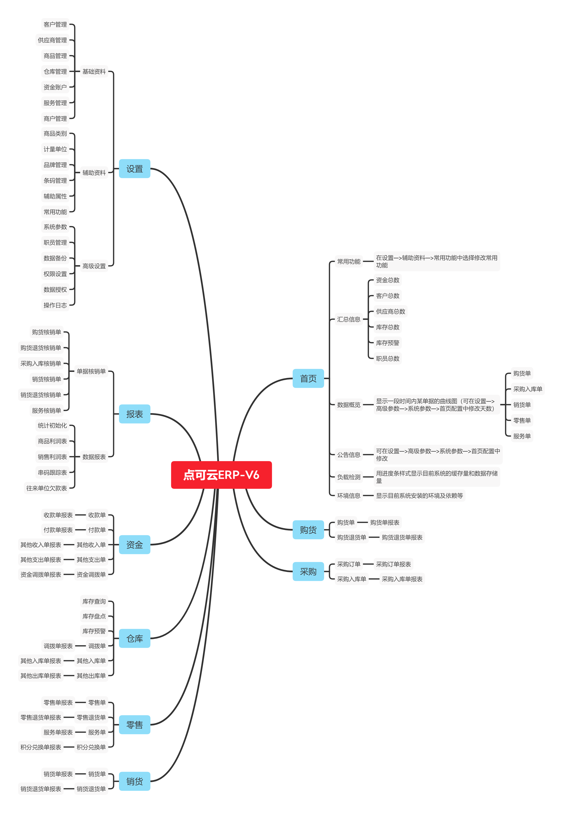


####   安装提示

> V6版本运行环境  PHP：5.6-7.3   MySQL： 5.6-5.7

> 如安装成功点击没反应，需配置伪静态thinkphp

> 保存提示错误信息，查看是否关闭数据库严格模式

> 点可云ERP教程 - PHPstudy安装篇 www.bilibili.com/video/BV1VT411Q7kV

> 点可云ERP教程 - 宝塔安装篇 www.bilibili.com/video/BV1As4y1Y7Ps

> 点可云ERP教程—关闭数据库严格模式  www.bilibili.com/video/BV1F54y1A7Vc


##   开源版使用须知
版权信息
1. 允许用于个人学习、毕业设计、教学案例、公益事业；

2. 如果商用必须保留版权信息，请自觉遵守；

3. 禁止将本项目的代码和资源进行任何形式的出售，产生的一切任何后果责任由侵权者自负。


####   系统使用截图

> 具体使用说明可点击下载查阅 https://share.weiyun.com/6qxJU0FA

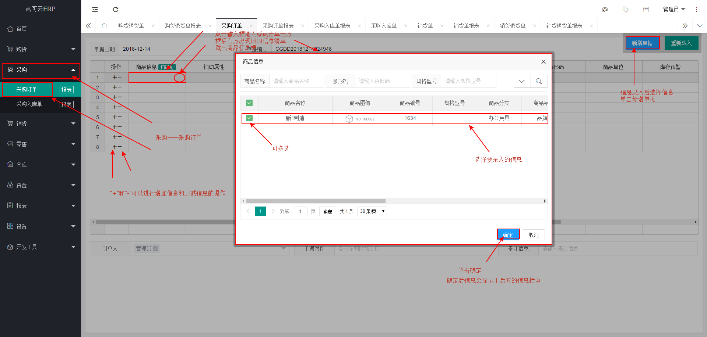
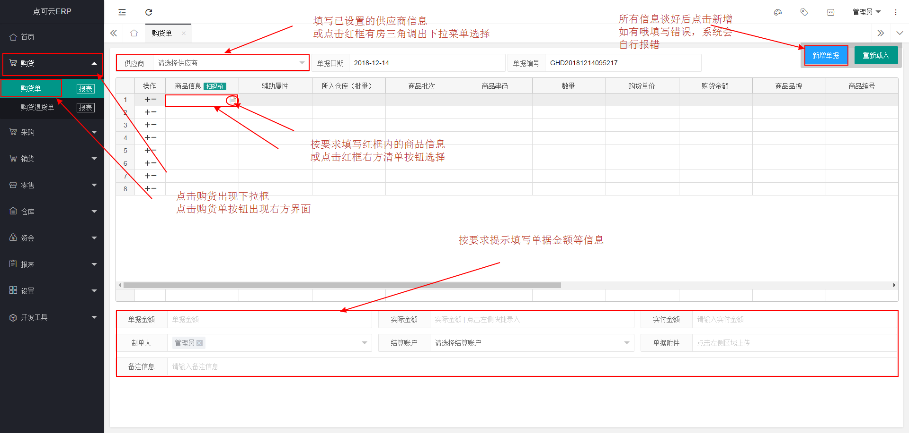
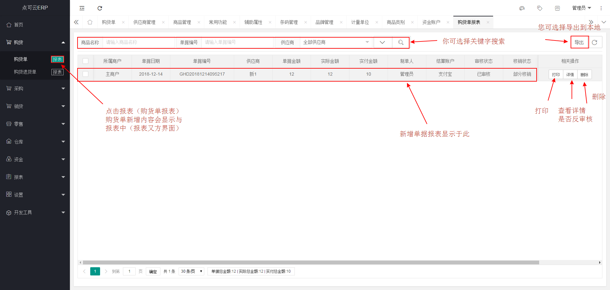
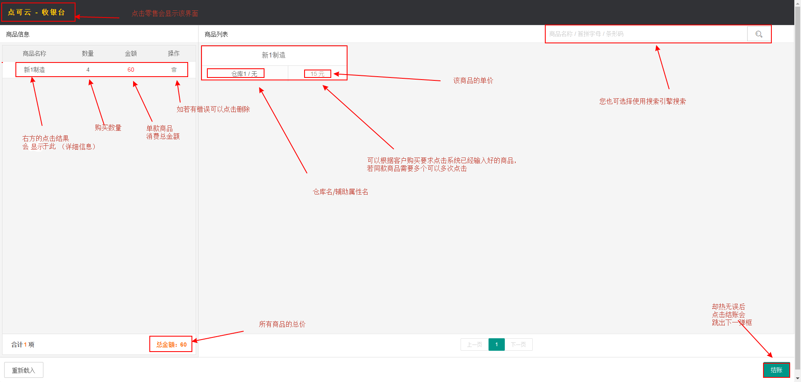
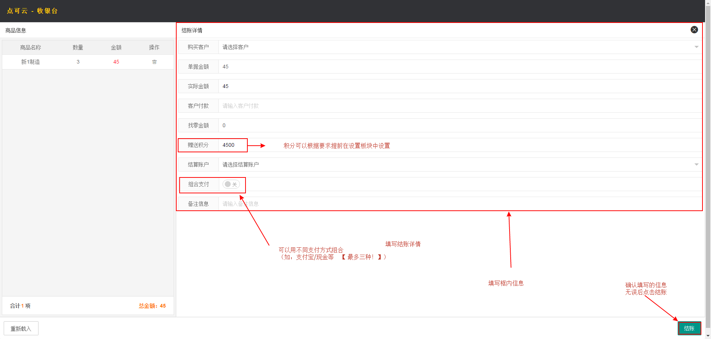
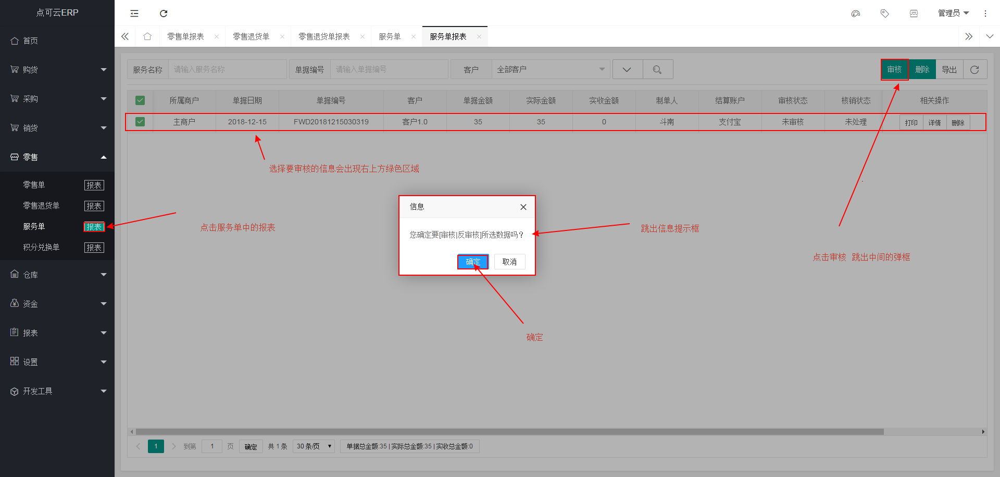
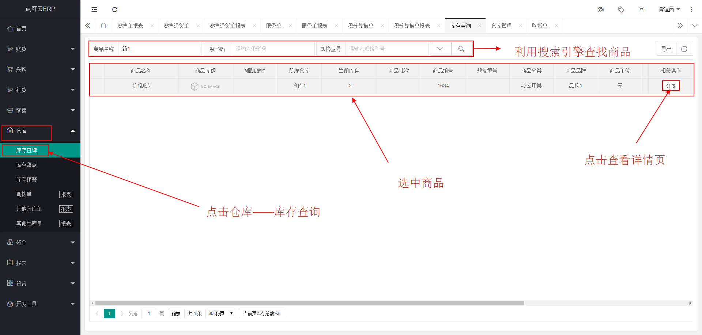
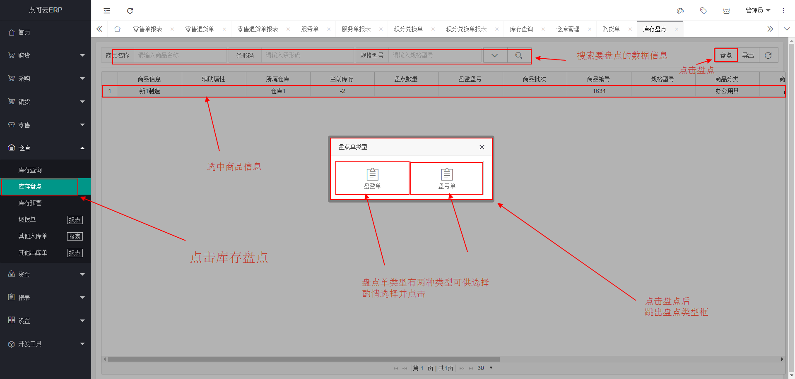
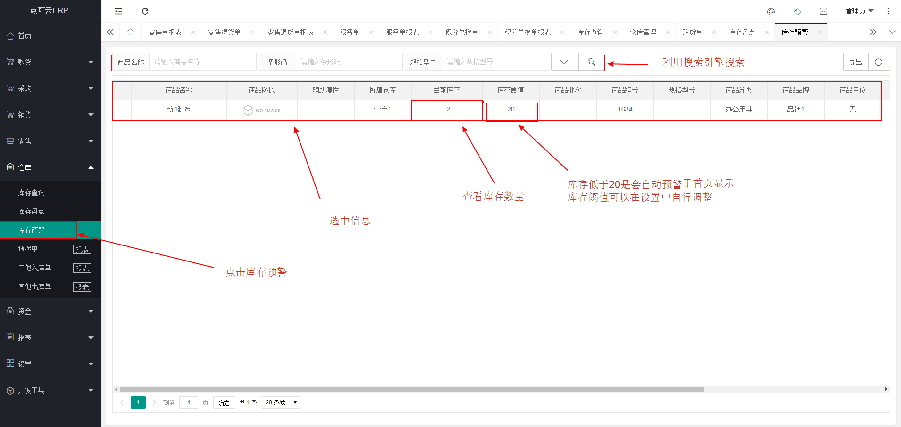
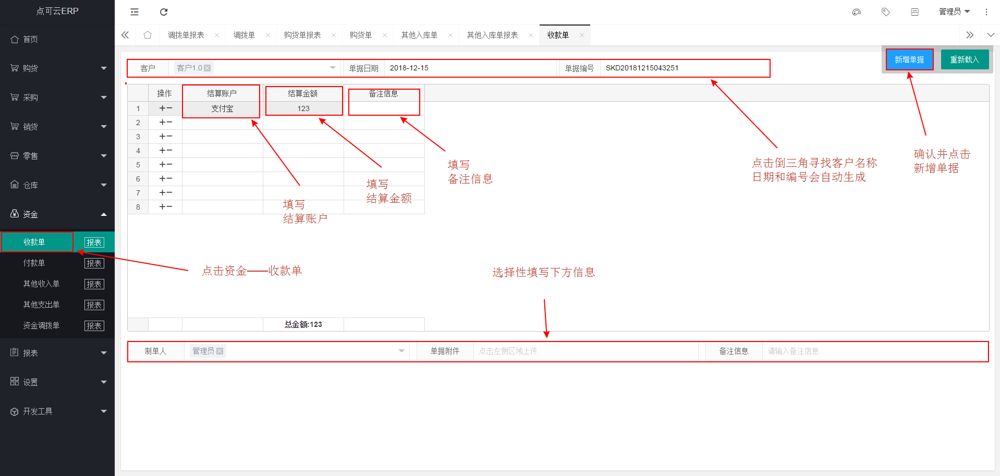
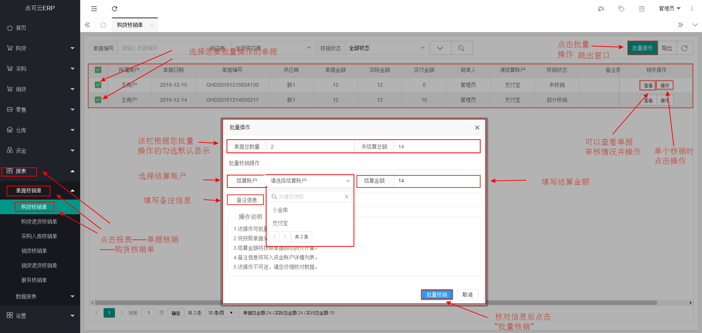
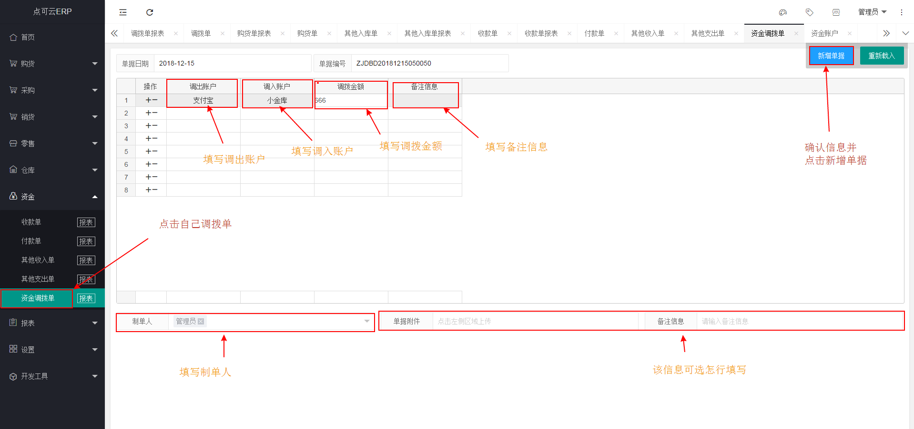
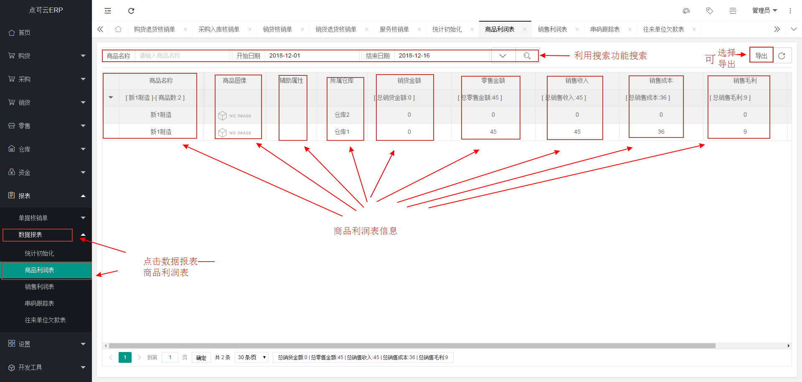


## 点可云ERP进销存V7全新商业版功能介绍

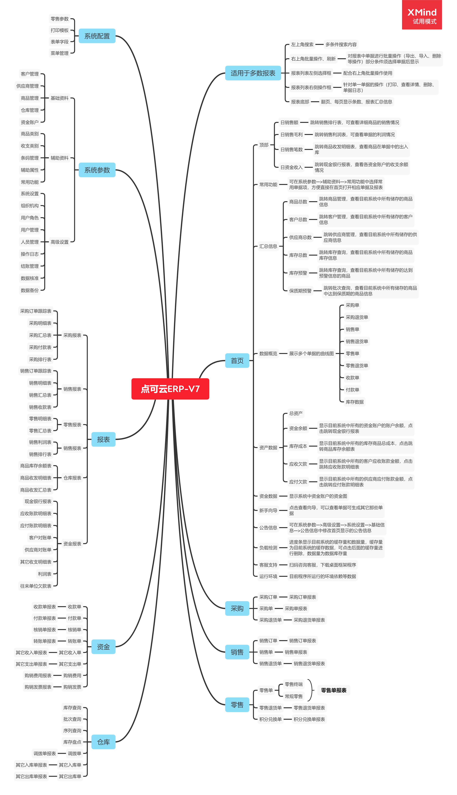


